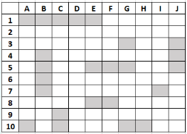
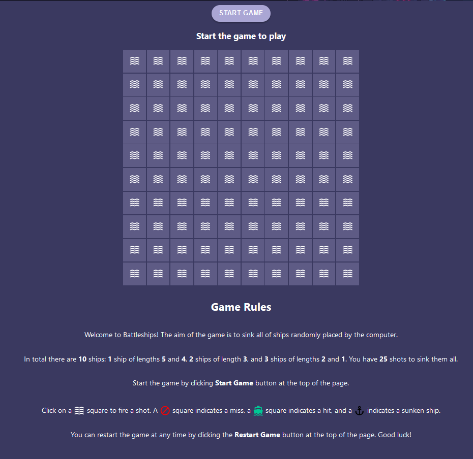
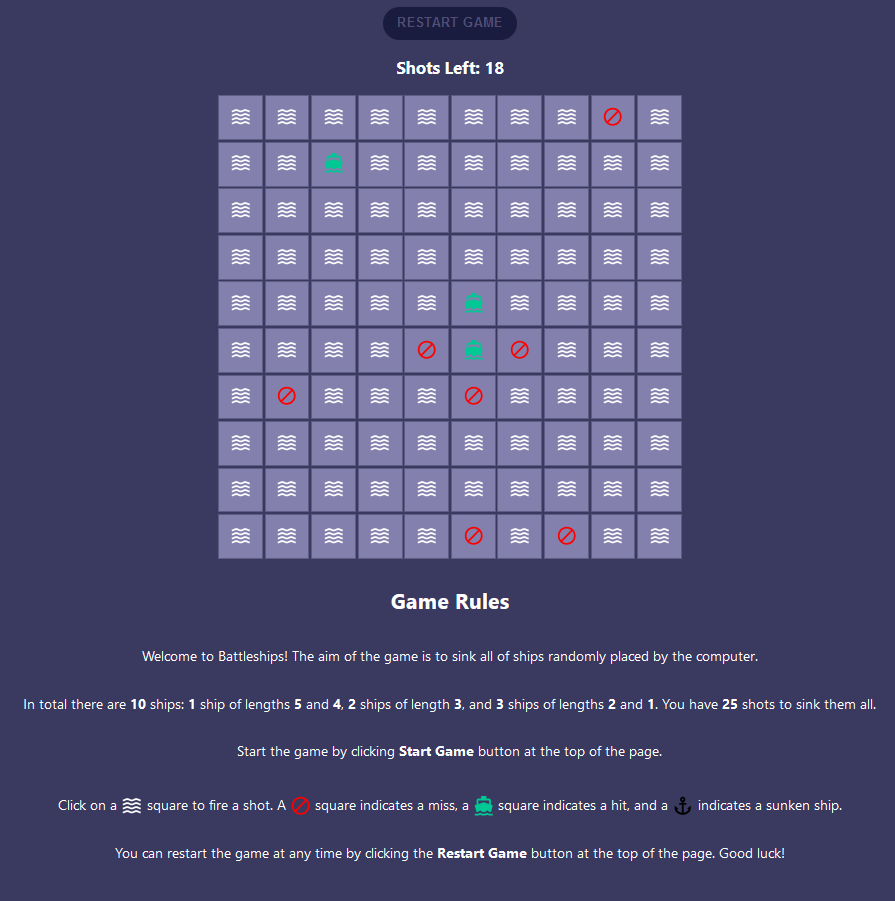
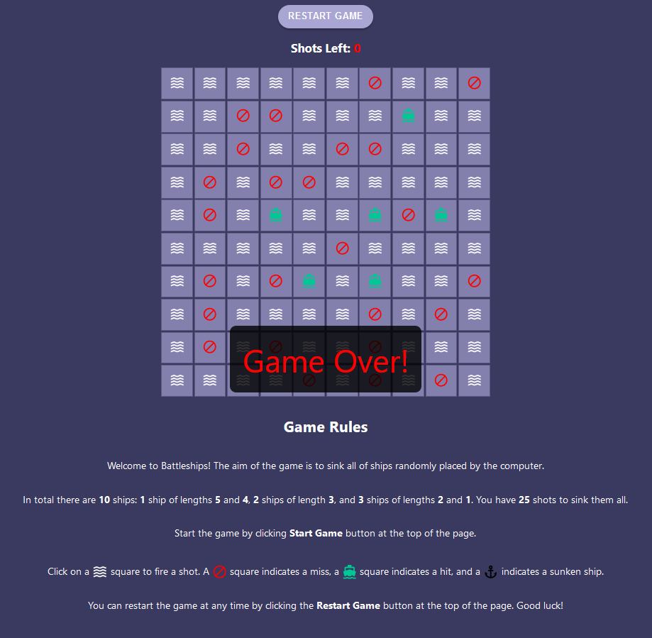
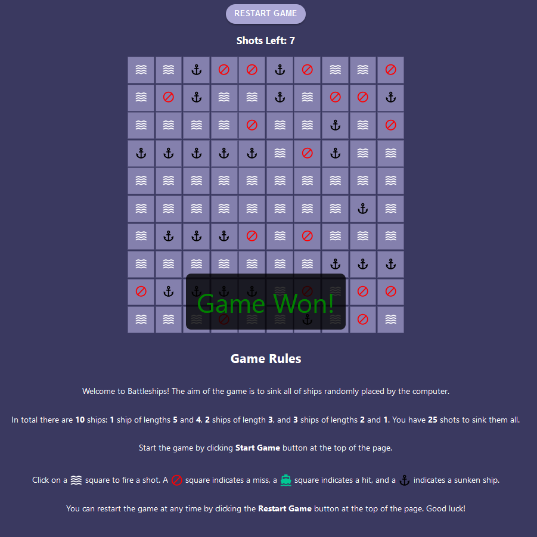
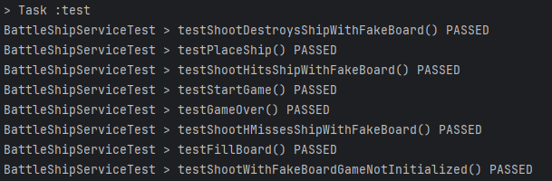
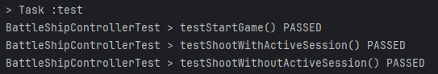
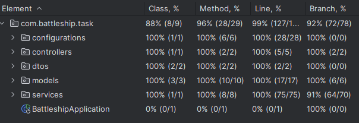

# Battle ship game

Made by Kasparas Putrius 2024

## Game rules:

- It is a player vs computer game. Player guesses where the ships have been deployed.
- In 10 x 10 broad such ships have been deployed:

  - 3 ships, size of 1

  - 3 ships, size of 2
  - 2 ships, size of 3
  - 1 ship, size of 4
  - 1 ship, size of 5

* Ships can only be deployed vertically or horizontally (diagonally is forbidden)
* Ships have to be deployd in such way that there would be at least 1 space between them. Ships can touch diagonally neither
* Correct way to deploy ships:

  

- Player tries to guess where the program has placed the ships
- Player make guess by guess, and the program shows if the player hit a part of the ship, sunk it or missed
- Player sees which postions have already been hit. You can't press the same postion twice
- Player has 25 shots to sunk all the ships. If ship is hit or sunk, then no shot is consumed, else 1 shot is used.
- Player wins the game when if all the ships are sunk, and not all 25 shots are used
- Player loses the game if all 25 shots are used and not all ships are sunk.
- Once the game ends player can start the game again by pressing "Restart Game" button

## Game screenshots

Game not started yet:

Game in progress:

Game over:

Game Won:

## Technology used

- Server side: Java 21 and Spring Boot 3.4.1
- Client side: Reactjs and Typescript

* Server side IDE: Intellij 2024.3.11
* Client side IDE: VsCode

## Running project

- Start server side by running _BattleshipApplication.java_
- Start client side by opening terminal in project _battleship-fe_ folder and running **_npm run start_**

## Tests

Tests for BattleShipService:

Tests for BattleShipController:

Test for server side coverage:

